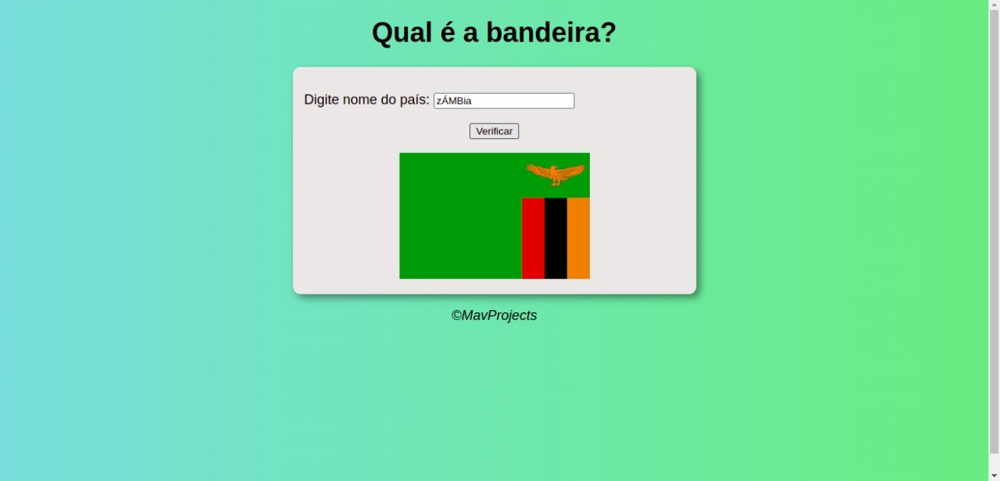

# Projeto-Bandeira

<h1>Descrição do projeto</h1>

Foi realizado no momento que estava realizando as aulas de JavaScrit do canal Curso em Video ministrado pelo professor Gustavo Guanabara, a base do HTML e CSS vem do canal, somente modificado alguns pequenos detalhes, esse projeto visa que quando o usuário digite o nome do país, apareça a bandeira dele.

<h2>Funcionalidade do projeto</h2>

<ul>
<li>Funcionalidade 1: 

Criado uma função verificar que é ativada quando clicado o botão no HTML com o evento onclick, essa função verifica o nome do país que foi inscrito no input e passa por cada caso da condicional switch até achar o país selecionado o que causará ao achar o nome digitado a ativação do elemento .setAttribute e mostrará a imagem assim em seguida causando o break para fora da condição.

</li>
<li>Funcionalidade 2:

Adicionado uma função removeAcento que mesmo que o usuário digite com acento certos ou errados, ou letras maiúsculas, ela passará para a condicional tudo em letras minúsculas e sem acento. Assim o usuário somente terá que digitar com as letras corretas o nome do país.

Exemplo digitado de um país com letras maiúsculas e minúsculas e acento: 

</li>
</li>
</ul>
<h2>Link do protótipo no GitHub Pages</h2>
<a href="https://akamaverick.github.io/Projeto-Bandeira/" target="_blank">🌟 Projeto Bandeira</a>
<h2>Imagens utilizadas neste projeto</h2>

Todas as imagens usadas foram adquiridas no Pixabay ou no Pexels que normalmente tem licença gratuita de uso, como alguns países não foi possível achar tal ocorrência, decidi por não coloca-los

<h3>Lista de países que não se encontra no projeto</h3>
<ul>
<li>Mianmar (antiga birmânia)</li>
<li>Singapura</li>
<li>Benim</li>
<li>Togo</li>
</ul>
